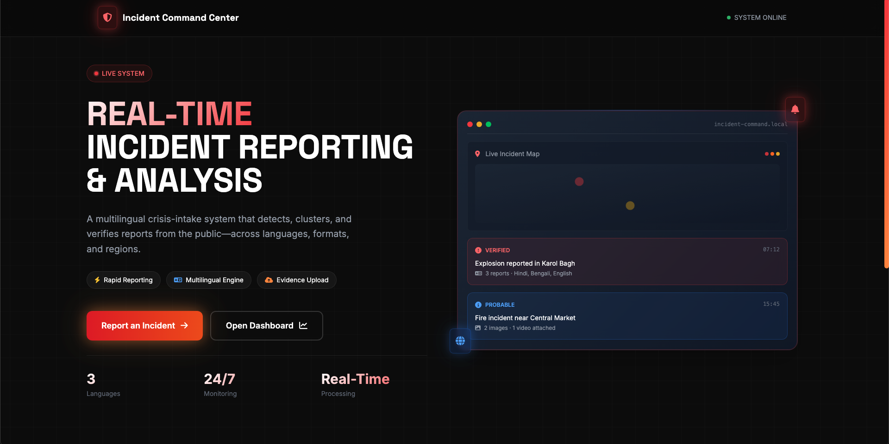
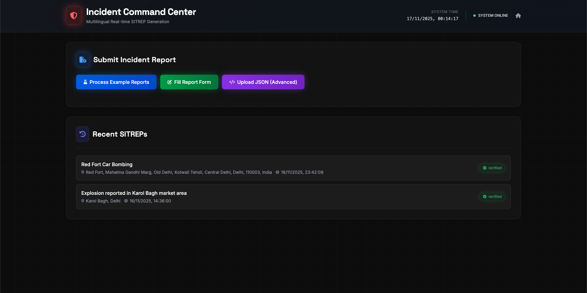
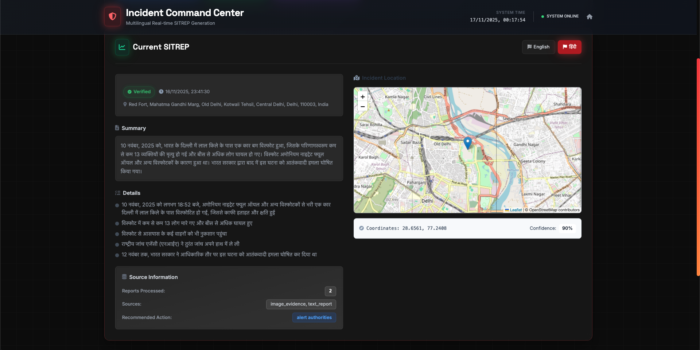

Before we start a note -> we have added snapshots in our README as our video quality was poor!

# 🚨 Multilingual Incident Room

> AI-powered emergency response platform using OpenAI GPT-4 Vision, Whisper & Lingo SDK

[](https://laravel.com)
[](https://openai.com)
[](https://lingo.dev)
[](https://tailwindcss.com)

## 📖 About

An intelligent incident reporting system that accepts **text, images, and videos**, analyzes them using AI, and generates multilingual situation reports (SITREPs) for emergency response teams.

**Key Capabilities:**
- 🎥 **Multimodal Analysis** - Process text, images & videos simultaneously
- 🤖 **AI-Powered** - GPT-4 Vision for images, Whisper for audio transcription
- 🌍 **Multilingual** - Bidirectional English ↔ Hindi translation via Lingo SDK
- 📊 **Structured Output** - Law enforcement-grade incident reports
- 🗺️ **Geolocation** - Interactive map with incident pinpointing

## 🏗️ Architecture

```
User Upload → Lingo Normalize → OpenAI Analyze → Lingo Translate → SITREP Output
  (Text +       (Detect lang      (GPT-4 Vision   (English to      (Bilingual
   Images +      & translate       + Whisper       Hindi)           EN + HI)
   Videos)       to English)       + FFmpeg)
```

## 🚀 Quick Start

### Prerequisites

- PHP 8.2+
- Composer
- Node.js 20+
- FFmpeg
- OpenAI API key
- Lingo API key

### Installation

```bash
# Clone & navigate
git clone https://github.com/radixanuj/multilingual-incident-room.git
cd multilingual-incident-room

# Install dependencies
composer install
npm install

# Setup environment
cp .env.example .env
php artisan key:generate

# Configure API keys in .env
OPENAI_API_KEY=sk-your-openai-key-here
LINGO_API_KEY=your-lingo-key-here

# Setup database
touch database/database.sqlite
php artisan migrate

# Build frontend
npm run build

# Start server
php artisan serve
```

**Access:** [http://localhost:8000/dashboard](http://localhost:8000/dashboard)

## 🎯 Features

### 🖼️ Image Analysis
GPT-4 Vision identifies people, objects, damage, vehicles, and text from photos

### 🎬 Video Intelligence
- FFmpeg extracts audio → Whisper transcribes speech
- FFmpeg extracts 3 key frames → GPT-4 Vision analyzes visuals
- Combined audio + visual analysis

### 📝 Structured Reports (JSON)
- Summary & detailed description
- People involved (victims, suspects, witnesses)
- Actions taken (emergency response, police, medical)
- Severity assessment & recommendations

### 🌍 Multilingual (Lingo SDK)
- **Input:** Auto-detect Hindi/Bengali/English → translate to English
- **Output:** Translate structured reports to Hindi
- Batch processing: 2-second latency

## 🛠️ Tech Stack

| Category | Technology |
|----------|-----------|
| **Backend** | Laravel 12, PHP 8.2 |
| **AI** | OpenAI GPT-4 Turbo, Whisper |
| **Translation** | Lingo SDK |
| **Frontend** | Tailwind CSS 4, Alpine.js |
| **Database** | SQLite |
| **Maps** | Leaflet.js + OpenStreetMap |
| **Video** | FFmpeg |


## Snapshots







---

**Built with ❤️ for Lingo Hackathon** | Laravel + OpenAI + Lingo SDK
